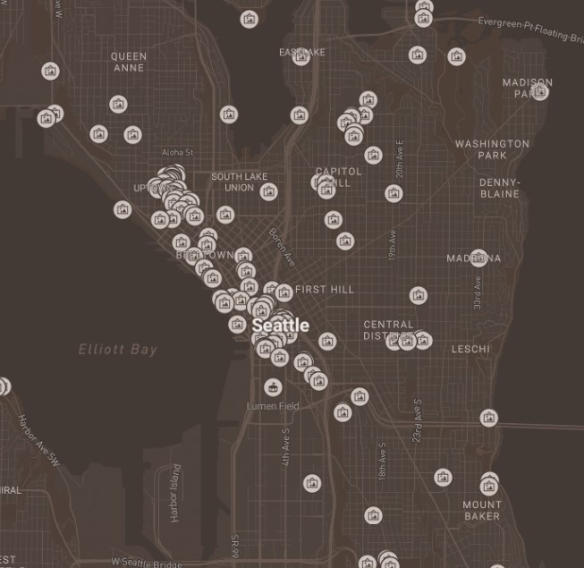

# Map Design and Tile Generation (Lab 4)
### Calvin Standaert

[Web Map Site](https://calvinuw.github.io/tile_mapping_CalvinUW/)

## Screenshots:

**Tileset 1 - Brown Monochrome Basemap:**

**Tileset 2 - Seattle Public Art Installations:**

**Tileset 3 - Brown Monochrome Basemap Overlain With Seattle Public Art Installations:**

**Tileset 4 - Environmental Protection-Themed Basemap:**

## Geographic Area:

This map examines the area of Seattle, Washington, including some of the greater Seattle area. Seattle was chosen as the focal point of the map due to its proximity to the university and also to showcase the dataset I chose for my thematic layer.

## Tile Sets:

The first tile set is made from a custom brown-colored monochrome basemap, with available zoom levels of 11 to 14. 

The second tile set is made from a thematic layer showing the location and names of public art installations in Seattle. The layer depicts the locations via icons that disappear upon greater levels of zoom. The thematic layer is overlain by a Mapbox light monochrome basemap. The available zoom levels for the tile set are levels 11 to 14.

The third tile set is made from a combination of a custom brown-colored monochrome basemap and an overlying thematic layer that depicts the locations and names of public art installations in Seattle. The available zoom levels for the tile set are levels 11 to 14. 

The fourth and final tile set is of a custom environmental protection-themed basemap, which uses varying shades of green for the majority of the map, with streets shown using brown to evoke a wood and leaf-like feeling. The available zoom levels for the tile set are levels 11 to 14.

## References:
The location data and names for the thematic layer of Seattle public art installations was provided by the [Seattle Open Data portal](https://data.seattle.gov/), with the specific dataset used being found [here](https://data.seattle.gov/Community/Public-Art-Data/j7sn-tdzk).

## Acknowledgement:
This map and the tilesets, layers, and basemaps contained in it were created by Calvin Standaert as part of a project in the University of Washington's 2023 Winter quarter of GEOG458 taught by Professor Bo Zhao. The code for this web map was derived from templates and guides created by Professor Bo Zhao and his teaching team.
